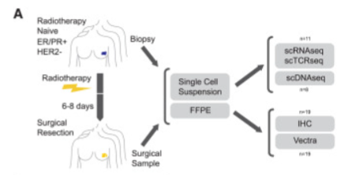

tags:: paper, equivocal
link:: [The impact of breast radiotherapy on the tumor genome and immune microenvironment in estrogen-receptor-positive breast cancer](https://www.sciencedirect.com/science/article/pii/S2211124725004747)
authors:: Barker, H E et al
n:: 11
dose-cgy:: NA
time-post-rt:: 6-8d
disease-site:: breast cancer
pub-date:: 2025-05-27
tissue-pre-rt:: tumor biopsy
tissue-post-rt:: tumor biopsy
fractionation:: NA
deg-comparison:: paired pre/post same patient
data-availability:: #SRA PRJNA818695

- 
- Specifically, in contrast to routine radiotherapy for breast cancer delivered in totality following surgery, we **delivered a small portion of radiotherapy preoperatively** to the tumor itself in lieu of postoperative radiotherapy to the tumor bed (commonly referred to as a boost) ([Figure 1](https://www.sciencedirect.com/science/article/pii/S2211124725004747#fig1)A). **The rest of the radiotherapy was delivered following surgery.**
	- Didn't get a full course of RT before RNA-seq
- In brief, 7 days before surgical resection, radiotherapy-naive patients received one of two biologically equivalent dose regiments of radiotherapy ([STAR Methods](https://www.sciencedirect.com/science/article/pii/S2211124725004747#sec8)).
- Fresh tumor material was collected via biopsy (up to 6 weeks) prior to radiotherapy and via the surgical resection specimen 6–8 days after completion of the preoperative tumor boost of radiotherapy.
- There were sufficient numbers of viable cells after thawing on paired specimens from **11 patients**, on whom we performed high-throughput 5′ scRNA-seq (10X Genomics) with matched single-cell [T cell receptor](https://www.sciencedirect.com/topics/biochemistry-genetics-and-molecular-biology/t-cell-receptor) sequencing (scTCR-seq).
- The scRNA-seq UMAPs labeled by time point (pre- and posttreatment) showed that many of the tumor and non-tumor clusters shifted in high-dimensional space after radiation
	- this implies that RNA-seq was done on posttreatment samples too