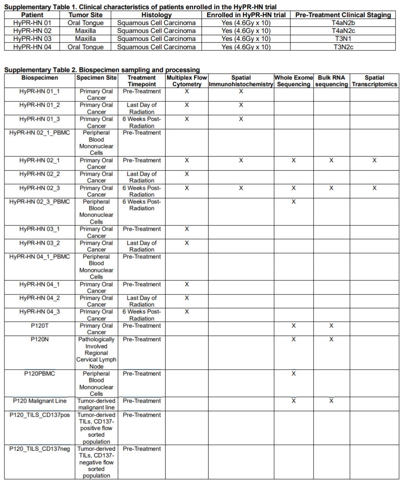
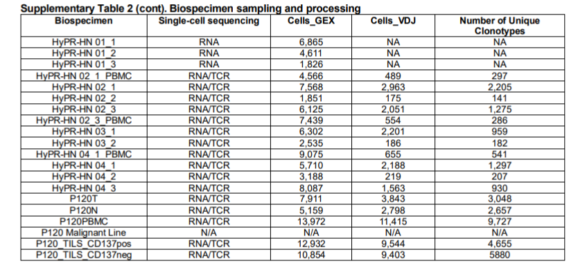

tags:: paper, confirmed
link:: [LINK](https://doi.org/10.1038/s41467-025-60827-w)
authors:: Himburg, H A et al
n:: 4
dose-cgy:: 46 Gy (PTVhi) + 35 Gy (PTVlo)
fractionation:: 10+10?
time-post-rt:: 0, 6w
disease-site:: HNSCC HPV-
pub-date:: 2025-07-01
tissue-pre-rt:: Pre-RT Bx
tissue-post-rt:: bx + definitive resection
deg-comparison:: paired pre/post same patient
data-availability:: #GEO GSE280982

- Enrolled patients undergo biopsies pre-treatment and **immediately after the last fraction** of radiotherapy in the clinic setting.
- Approximately **6 weeks after completion** of radiation, patients are taken for definitive resection of residual disease with an additional research-specific biopsy at the time of surgery.
- As above, biopsy samples were triaged for translational studies. However, for the HyPR-HN study, **samples were prioritized first for single-cell sequencing**. After single-cell suspensions were processed for sequencing, the remaining cells from the sample underwent mFC.
- In cases with additional sufficient tissue samples, separate pieces were preserved for mIF, **bulk RNA sequencing, whole-exome sequencing, and spatial transcriptomics.**
	- So only where there was sufficient tissue?
- 
	- Looks like only patient 2 had bulk RNA seq
- 
	- But everyone got single cell sequencing of RNA