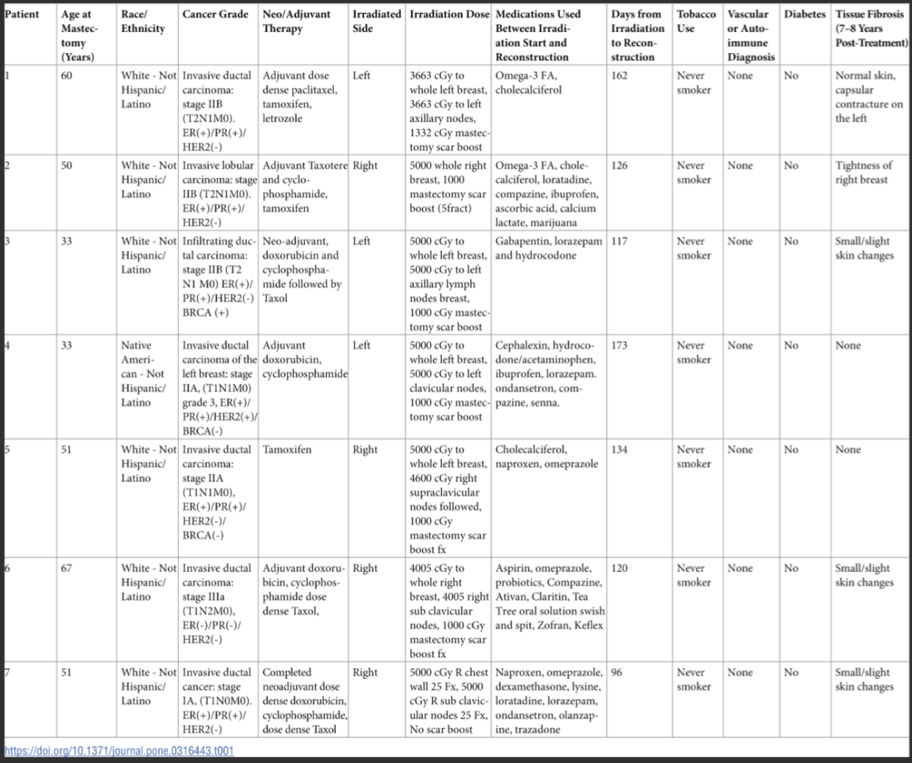

tags:: paper, equivocal
link:: [LINK](https://journals.plos.org/plosone/article?id=10.1371/journal.pone.0316443)
authors:: Miller, A et al
n:: 7
dose-cgy:: NA
time-post-rt:: 133 days (median, range 96-173)
disease-site:: Breast cancer
pub-date:: 2025-03-03
tissue-pre-rt:: Skin, muscle, capsule
tissue-post-rt:: Skin, muscle, capsule
fractionation:: NA
deg-comparison:: paired pre/post same patient

- The paired tissue samples (non-irradiated and irradiated) were collected at the time of final breast reconstruction, which included skin, the pectoralis major muscle, and capsule tissue around the expander prostheses.
	- BOTH WERE COLLECTED AT RECON
- # Quote
- During the **removal of tissue expanders and placement of silicone implants and/or autologous tissue**, three different tissue types were collected from non-irradiated and irradiated breasts. Skin samples were taken centrally from the mastectomy scar. Muscle samples were obtained from the underlying pectoralis major muscle. If muscle was not found directly under the mastectomy scar, it was taken from a point superior to the incision within the radiation field. A capsule sample was taken from around the expander directly inferior to the mastectomy scar ([Fig 1](https://journals.plos.org/plosone/article?id=10.1371/journal.pone.0316443#pone-0316443-g001)). In all cases, samples were taken from the radiated field and the corresponding location in the contralateral breast. Tissue samples were immediately submerged in RNAlater™ (Sigma-Aldrich, St. Louis, MO, USA), stored at 4°C overnight, and subsequently stored at −80°C until further use. Additional fresh tissue samples were frozen and stored at − 80°C for histopathological analyses.
- 
- ---
- TLDR:
	- Self-controlled design using contralateral breast as pre-RT baseline
- ## Data Availability
  Public data available (GSE278183)
- ## Source
  Published in PLOS ONE, March 2025